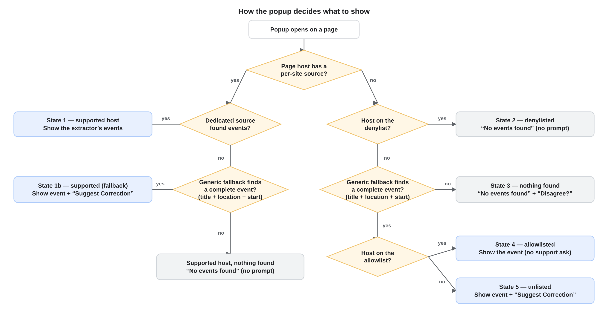

# Product requirements

What the extension does, described as user-facing behavior — independent of how
it's built (that's [highLevelDesign.md](highLevelDesign.md) and the per-file map
in [fileDescriptions.md](fileDescriptions.md)). The tunable values called out
below (default duration, the events cap, fallback copy, the host allow/denylist)
live in `config.js`.

This file is a **rough, feature-level description**. The **specific, numbered UI
requirements** for the popup — exact text, layout, colors, card structure, the
count label, scroll cues — live in [uiRequirements.md](uiRequirements.md) (the
popup's testable contract, referenced by the UI snapshot tests). The rule of
thumb: the *what and why* of a feature is here; the *exact rendering* of the popup
is there. The toolbar icon and the source-request issue form are features in their
own right and stay here.

## Purpose

Turn the event on the current web page into a pre-filled Google Calendar event,
opened in a new tab, in one click.

## Toolbar icon

The icon signals how the current page's host is classified:

- **green** — the host has a dedicated extractor;
- **gray** — the host is on the fallback denylist, where we've deliberately
  decided not to extract (the "denylisted host" popup state below);
- **blue** — every other page.

It reflects the host's classification, not whether an event was found — the icon
can't read the page, so a page where the generic fallback later finds an event
still shows the blue icon.

## What the popup shows

When opened, the popup lands in one of five states:

1. **Supported host** — show the events the dedicated extractor found.
2. **Denylisted host** — show nothing and prompt for nothing: no event, no
   support request, no policy link. We've deliberately decided not to extract
   there, so there's nothing to dispute.
3. **Unsupported, nothing found** — when the host isn't denylisted and the
   generic fallback finds no *complete* event, show the empty state with a link to
   the public policy doc ([extraction-policy.md](extraction-policy.md)).
4. **Allowlisted, event found** — show the event; don't ask for support (the
   generic result is already trusted there).
5. **Unlisted, event found** — show the event **and** offer to request
   first-class support for the site (a prefilled "Event source request" GitHub
   issue), so a good page can become a supported source.

A fallback (non-dedicated) event counts as **complete** only when it has all
three of a title, a location, and a start time; anything less is "nothing found".

How each state is *rendered* — the heading text, the empty-state glyph, and the
link text, placement, and styling — is specified in
[uiRequirements.md](uiRequirements.md).

## Events

- One **card** per distinct event on the page. An ordinary event page yields one;
  a listing or series page (a film week, a festival) yields one card per event.
- **Multi-instance events.** A single event with several showings — a film with
  several screenings, a show that runs nightly, a multi-night concert — is *one*
  event with several **instances** (each its own start/end). What folds into one
  event is showings matching on title, location, description, and timezone
  (differing only in time); distinct events that merely share a title stay
  separate. Such an event's instances are grouped **by month** into one or more
  cards — a single card for a month with one showing, or a grouped card with a
  button per showing (a day with several showings stays in its month's card as
  several buttons, never split off).

The exact card grouping and ordering, card appearance (the calendar chip, card
weight, the year pill, headers, truncation), how an event is opened, the
scroll/overflow cues, and the count-label wording are specified in
[uiRequirements.md](uiRequirements.md).

## Event fields

- **Description** preserves its line and paragraph breaks into the Calendar
  details. Single-line fields (title, location) are whitespace-collapsed.
- **Title** falls back to the page/tab title, and then to a configured default
  (`fallbackEventTitle`) when the page gives none.

## Dates, times, and timezones

- A timed date with **no timezone** is a floating local time: the event shows the
  same wall-clock time the page displayed, wherever the viewer is.
- A date with an explicit offset (or trailing `Z`) is an exact instant: the event
  happens at the same moment regardless of the viewer's timezone.
- A site known to run in a fixed place pins the event to that city's timezone, so
  the time reads as that city shows it for every viewer.
- A date with **no time** becomes an all-day event.
- When the page gives a start but no end, the event is `defaultEventDurationMs`
  long (2 hours by default). All-day events stay all-day.

These rules govern the *instant* the Calendar event lands on. How a time is
*displayed* on a card — rounding, ranges, "All day", and the literal wall-clock
rule — is in [uiRequirements.md](uiRequirements.md).

## Requesting support

"Suggest Correction" (state 5) opens a prefilled GitHub "Event source request"
issue. Submitting it kicks off the automated extractor, which implements support
for the site and opens a pull request for review. A request whose host is already
on the allow- or denylist is closed automatically, without a run.
