# Popup UI requirements

The **specific, testable UI requirements** for the extension's popup — what it
must render, and how it must look and read, down to exact strings, colors,
placement, and structure.

This is deliberately separate from
[productRequirements.md](productRequirements.md), which is the **rough,
feature-level description** of what the extension does and why. The split: "the
popup turns the page's event into a one-click calendar link" is a feature
description and lives there; "an off-current-year chip shows a gray pill for a
past year" is a specific UI requirement and lives here. Anything that isn't a
pixel-assertable *rendering* — the GitHub source-request issue form, and the
calendar-URL / timezone *semantics* — stays in productRequirements. This doc
covers the popup's rendering **and** the toolbar/extension icon (§10): both are
pixel-assertable, so both are specified here as numbered, snapshot-pinned leaves.

> # ⚠️ INCOMPLETE TESTING — A GREEN BUILD MEANS "CLAIMED", NOT "FULLY VERIFIED" ⚠️
>
> Every *render* leaf below has its own inline snapshot, and every *behavior* leaf
> a behavior test, so the coverage gate proves each leaf is *claimed* by the right
> kind of test. What it does **not** prove is how *faithfully* the behavioral
> leaves are checked: a leaf tagged `_(behavior)_` (a click → new-tab →
> close-popup action) has no pixels, so it's verified by
> `test/unit/events-view-actions.test.js`, which **stubs
> `chrome.tabs.create`/`window.close`** — confirming our code *asks* for the right
> action, **not** that a real Chrome performs it. A faithful (non-stub)
> verification is still owed; tracked in the issue linked from
> [`docs/claude/testing.md`](claude/testing.md). Likewise, an `_(icon)_` leaf
> (§10) is verified offline through a **fake Chrome**, so it pins the icon the
> extension *generates*, not that real Chrome *paints* it — only the e2e test does
> that.

**Numbering.** Every leaf requirement carries a stable number (e.g. `5.6.1`). A
UI snapshot case (`test/ui/`) names the requirement(s) it verifies by number, so a
case and the requirement it pins can be cross-checked. Add new requirements with
new numbers; don't renumber or reuse existing ones.

**Verification kind.** Most leaves are *render* requirements, each pinned by a UI
snapshot shown in a **two-column table** below — the generated image on the left,
the requirement on the right. A leaf tagged **`_(behavior)_`** right after its
number is instead verified by a behavior test (a click/navigation a static image
can't observe), and its left cell carries a note rather than an image. A leaf
tagged **`_(TBD)_`** is a **placeholder** — an edge case whose correct behavior
isn't decided yet; its left cell shows a loud "TO BE DECIDED" banner (with a
provisional render of *current* behavior when one exists), and it's exempt from
the one-snapshot-per-leaf rule until the decision is made. A leaf tagged
**`_(icon)_`** is the toolbar/extension icon: pinned by a `req-<id>` snapshot
exactly like a render leaf — same naming, same gallery, same comparison — only its
PNG is produced by a different renderer (the real `ui/toolbar-icon.js` loaded into
a fake browser, `test/ui/icon-renderer.js`) instead of the popup's `render()`
(`render-snapshot.js` dispatches by kind). So the coverage gate is **segmented**
only into snapshot vs behavior (`test/ui/behavior-coverage.js`): render and icon
leaves each carry one `req-<id>` snapshot, a behavior leaf carries a note instead.
The left cells are generated; don't hand-edit a line carrying a
`<!-- req-gallery:… -->` marker.

**One spec per leaf.** Each leaf requirement states exactly one display
specification. When a rendering is conditional — "in case X render Y, in case Z
render W" — split it into one numbered child per case rather than bundling the
cases in a single bullet (the parent becomes a heading, the cases its leaves), as
done for the `5.6`, `5.7`, `6.1`, and `6.2` groups.

The five popup **states** (supported / denylisted / nothing-found / allowlisted /
unlisted) and *when* each occurs are defined in
[productRequirements.md](productRequirements.md); this doc specifies how each is
*rendered*. Tunable values referenced below (`maxCardsShown`,
`maxCardsExpanded`, `cardsVisibleBeforeScroll`) live in `config.js`.

## 1. Heading

<table>
<tr>
<td valign="top" width="320">

 <!-- req-gallery:1.1 -->

</td>
<td valign="top">

`1.1` While the page is being read, the heading reads **"Reading page…"**.

</td>
</tr>
</table>

<table>
<tr>
<td valign="top" width="320">

 <!-- req-gallery:1.2 -->

</td>
<td valign="top">

`1.2` When one or more events are shown, the heading reads **"Add to Google
Calendar"**.

</td>
</tr>
</table>

<table>
<tr>
<td valign="top" width="320">

 <!-- req-gallery:1.3 -->

</td>
<td valign="top">

`1.3` When no events are shown, the heading reads **"No events found on this
page"**.

</td>
</tr>
</table>

## 2. Empty state (nothing to add)

<table>
<tr>
<td valign="top" width="320">

 <!-- req-gallery:2.1 -->

</td>
<td valign="top">

`2.1` When there are no events to show, the event area shows a single muted,
calendar-shaped glyph (a bordered box with a header strip), centered with
generous vertical spacing — so the popup has a "face" rather than a bare line.

</td>
</tr>
</table>

<table>
<tr>
<td valign="top" width="320">

 <!-- req-gallery:2.2 -->

</td>
<td valign="top">

`2.2` In the nothing-found state (state 3), the "Disagree?" link (→ `3.2`) sits
**beneath** the glyph.

</td>
</tr>
</table>

<table>
<tr>
<td valign="top" width="320">

 <!-- req-gallery:2.3 -->

</td>
<td valign="top">

`2.3` In the denylisted state (state 2), and on a supported host that simply
found no events, the glyph stands **alone** — no link beneath it.

</td>
</tr>
</table>

## 3. Affordance links

<table>
<tr>
<td valign="top" width="320">

 <!-- req-gallery:3.1 -->

</td>
<td valign="top">

`3.1` **Suggest Correction** — shown only in the unlisted-with-event state
(state 5). It sits on the **heading line, right-aligned** (the heading becomes a
row: title on the left, link on the right, vertically centered). Clicking it
opens the prefilled source-request issue (the issue form itself is out of
scope — see productRequirements).

</td>
</tr>
</table>

<table>
<tr>
<td valign="top" width="320">

 <!-- req-gallery:3.2 -->

</td>
<td valign="top">

`3.2` **Disagree?** — shown only in the nothing-found state (state 3), beneath
the empty-state glyph (→ `2.2`). Clicking it opens the public extraction-policy
doc.

</td>
</tr>
</table>

<table>
<tr>
<td valign="top" width="320">

 <!-- req-gallery:3.3 -->

</td>
<td valign="top">

`3.3` Both links share one small, understated treatment (≈11px, accent blue, no
underline at rest, underline on hover) so neither reads as a primary action.

</td>
</tr>
</table>

<table>
<tr>
<td valign="top" width="320">

🚩 _Behavior leaf — verified by `test/unit/events-view-actions.test.js` (a click a snapshot can't show), not an image._ <!-- req-gallery:3.4 -->

</td>
<td valign="top">

`3.4` _(behavior)_ Each link opens its target in a **new tab** (adjacent to the
current one) and closes the popup.

</td>
</tr>
</table>

## 4. Event cards — grouping & ordering

<table>
<tr>
<td valign="top" width="320">

 <!-- req-gallery:4.1 -->

</td>
<td valign="top">

`4.1` One **card** per distinct event on the page; a listing/series page yields
one card per event.

</td>
</tr>
</table>

- `4.2` A multi-instance event (an event carrying several instances) groups its
  instances **by month** (same calendar month and year) into one or more cards:

<table>
<tr>
<td valign="top" width="320">

 <!-- req-gallery:4.2.1 -->

</td>
<td valign="top">

`4.2.1` Two showings in the **same** month group into **one** grouped card.

</td>
</tr>
</table>

<table>
<tr>
<td valign="top" width="320">

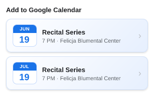 <!-- req-gallery:4.2.2 -->

</td>
<td valign="top">

`4.2.2` Two showings in **different** months **split** into one card per month.

</td>
</tr>
</table>

<table>
<tr>
<td valign="top" width="320">

⚠️ **TO BE DECIDED** — behavior not yet decided; provisional render of CURRENT behavior:  <!-- req-gallery:4.2.3 -->

</td>
<td valign="top">

`4.2.3` _(TBD)_ Edge case — **one event** with three instances: one in June, one a
**multi-day instance spanning June → July**, and one in July. Today the spanning
instance groups by its **start** (June), so it shows under June only and never
under July (provisional render at left). Whether a cross-month instance should
also surface in the later month is **to be decided**.

</td>
</tr>
</table>

<table>
<tr>
<td valign="top" width="320">

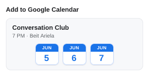 <!-- req-gallery:4.3 -->

</td>
<td valign="top">

`4.3` Instances are **never merged**: a card built from N instances always
exposes N addable buttons. Consecutive days are grouped exactly like scattered
ones — a run is never collapsed into a single spanning event.

</td>
</tr>
</table>

<table>
<tr>
<td valign="top" width="320">

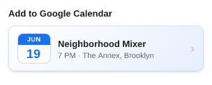 <!-- req-gallery:4.4 -->

</td>
<td valign="top">

`4.4` A **single card** — a month with a single showing, or any instance with
no usable date: the **whole card is clickable**. (The image pins its *appearance*
as one whole-surface button; the click itself is verified by `9.1`, and the
resting visual cue is the chevron — see `5.4`. A mouse-cursor / `:hover` state
isn't capturable by the static renderer — see note below the gallery.)

</td>
</tr>
</table>

<table>
<tr>
<td valign="top" width="320">

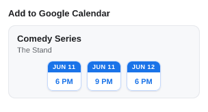 <!-- req-gallery:4.5 -->

</td>
<td valign="top">

`4.5` A day with **two or more showings** contributes **one button per showing**
to its month's grouped card — it is **not** peeled off into a separate card; the
showings are told apart by their time (→ `5.3`).

</td>
</tr>
</table>

<table>
<tr>
<td valign="top" width="320">

 <!-- req-gallery:4.6 -->

</td>
<td valign="top">

`4.6` A **month card** (grouped card) — an event with two or more showings in
one month: an **unclickable** container, a title/location header over **one
button per showing**. A month with a single showing is a single card (→ `4.4`).

</td>
</tr>
</table>

<table>
<tr>
<td valign="top" width="320">

 <!-- req-gallery:4.7 -->

</td>
<td valign="top">

`4.7` A grouped card has no single left calendar icon — its per-showing chip
buttons (→ `5`) are its calendar visuals.

</td>
</tr>
</table>

<table>
<tr>
<td valign="top" width="320">

 <!-- req-gallery:4.8 -->

</td>
<td valign="top">

`4.8` An event whose **single instance's own start–end crosses several days**
stays one **single card** — it is *not* split into a button per day (only
separate instances ever become multiple buttons). Its chip shows **just the start
day** (today there is **no** date range on the calendar chip) and its line shows
the instance's time (or "All day"), not a per-day breakdown. (Whether a long /
multi-month span *should* show a range is the open question in `4.10`.)

</td>
</tr>
</table>

<table>
<tr>
<td valign="top" width="320">

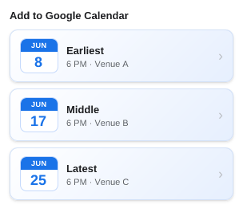 <!-- req-gallery:4.9 -->

</td>
<td valign="top">

`4.9` Cards are ordered by their **earliest showing's start**, and an event's
showings are ordered within its card — so everything reads chronologically
regardless of the order the page listed it in. (The image shows **both**: cards
sorted across the list, and a grouped card whose shuffled showings render in
order.)

</td>
</tr>
</table>

<table>
<tr>
<td valign="top" width="320">

⚠️ **TO BE DECIDED** — behavior not yet decided; provisional render of CURRENT behavior:  <!-- req-gallery:4.10 -->

</td>
<td valign="top">

`4.10` _(TBD)_ A single instance spanning **multiple months** (e.g. Jun 28 → Jul 3):
today its chip shows just the **start day** (provisional render at left). Whether a
long or multi-month span should instead show a **date range** on the calendar chip
— and how the span should read on the line — is **to be decided**.

</td>
</tr>
</table>

## 5. Event cards — appearance

<table>
<tr>
<td valign="top" width="320">

 <!-- req-gallery:5.1 -->

</td>
<td valign="top">

`5.1` The **calendar chip** is the popup's single "addable event" motif: a
colored banner (the shared context) over a prominent body (the pick). The same
chip marks an addable event whether it's a single card's left indicator or one
of a grouped card's instance buttons.

</td>
</tr>
</table>

<table>
<tr>
<td valign="top" width="320">

 <!-- req-gallery:5.2 -->

</td>
<td valign="top">

`5.2` **Day chip** — a month banner over the day-of-month (e.g. JUN / 19). Used
as a single card's left indicator and as a month card's per-day buttons.

</td>
</tr>
</table>

- `5.3` **Time chip** — a full-date banner over the showing's time. Used as a
  same-day card's buttons, and as a month card's buttons when its days carry
  different times (→ `5.7.2`).

<table>
<tr>
<td valign="top" width="320">

 <!-- req-gallery:5.3.1 -->

</td>
<td valign="top">

`5.3.1` A single-time showing shows just the time (e.g. JUN 19 / 1 PM).

</td>
</tr>
</table>

<table>
<tr>
<td valign="top" width="320">

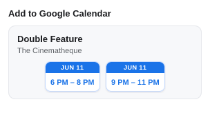 <!-- req-gallery:5.3.2 -->

</td>
<td valign="top">

`5.3.2` A showing with a start **and** end shows the en-dash time range inside
the button (e.g. JUN 19 / 4:30 PM – 6:18 PM).

</td>
</tr>
</table>

<table>
<tr>
<td valign="top" width="320">

 <!-- req-gallery:5.4 -->

</td>
<td valign="top">

`5.4` **Single-card weight.** A single card is the heavier element — visibly
elevated and tinted, its whole surface one click target — with a trailing **"›"
chevron** as the resting cue that the card itself is the button.

</td>
</tr>
</table>

<table>
<tr>
<td valign="top" width="320">

 <!-- req-gallery:5.5 -->

</td>
<td valign="top">

`5.5` **Grouped-card weight.** A grouped card (same-day, month) is lighter and
flat, is **not** itself clickable, and has **no** chevron — you press one of its
inner chip buttons instead.

</td>
</tr>
</table>

- `5.6` **Year pill.** A chip whose date falls outside the current year carries a
  small year pill on the corner of its calendar icon.

<table>
<tr>
<td valign="top" width="320">

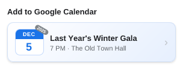 <!-- req-gallery:5.6.1 -->

</td>
<td valign="top">

`5.6.1` A **past** year shows a **gray** pill.

</td>
</tr>
</table>

<table>
<tr>
<td valign="top" width="320">

 <!-- req-gallery:5.6.2 -->

</td>
<td valign="top">

`5.6.2` A **future** year shows a **green** ("upcoming") pill — never red
(a next-year event isn't an error).

</td>
</tr>
</table>

<table>
<tr>
<td valign="top" width="320">

 <!-- req-gallery:5.6.3 -->

</td>
<td valign="top">

`5.6.3` The **current** year shows **no** pill.

</td>
</tr>
</table>

- `5.7` **Grouped-card header time.**

<table>
<tr>
<td valign="top" width="320">

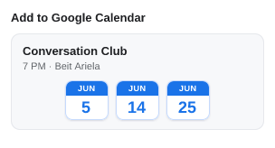 <!-- req-gallery:5.7.1 -->

</td>
<td valign="top">

`5.7.1` When a month card's days all share one start time, that time leads the
header line ("7 PM · &lt;location&gt;") and the buttons stay bare day chips.

</td>
</tr>
</table>

<table>
<tr>
<td valign="top" width="320">

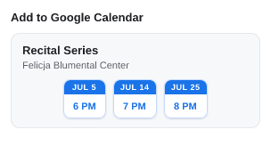 <!-- req-gallery:5.7.2 -->

</td>
<td valign="top">

`5.7.2` When the days carry **different** times, no shared time is shown, so
each button becomes a **time chip** (its own day's time) so no time is lost,
and the header is location-only.

</td>
</tr>
</table>

<table>
<tr>
<td valign="top" width="320">

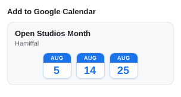 <!-- req-gallery:5.7.3 -->

</td>
<td valign="top">

`5.7.3` When a month card's days are **all all-day** (no time), the buttons stay
plain day chips and the header reads **"All day · &lt;location&gt;"** — the "All
day" label beside the location, mirroring a single all-day card's line. (If only
*some* days are all-day, no single time fits, so the header stays location-only.)

</td>
</tr>
</table>

<table>
<tr>
<td valign="top" width="320">

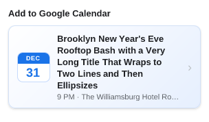 <!-- req-gallery:5.8 -->

</td>
<td valign="top">

`5.8` **Truncation never grows the popup.** A title clamps to two lines; the
time/location line is a single line that ellipsizes; the popup's width is fixed.

</td>
</tr>
</table>

## 6. Date & time display

- `6.1` **Round vs. non-round time.**

<table>
<tr>
<td valign="top" width="320">

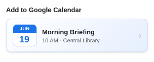 <!-- req-gallery:6.1.1 -->

</td>
<td valign="top">

`6.1.1` A round hour drops its minutes ("10 AM", not "10:00 AM").

</td>
</tr>
</table>

<table>
<tr>
<td valign="top" width="320">

 <!-- req-gallery:6.1.2 -->

</td>
<td valign="top">

`6.1.2` A non-round time keeps its minutes ("6:30 PM").

</td>
</tr>
</table>

- `6.2` **Start with an end.**

<table>
<tr>
<td valign="top" width="320">

 <!-- req-gallery:6.2.1 -->

</td>
<td valign="top">

`6.2.1` A start with an end shows as a time range joined by an **en dash**
("6:30 PM – 8:30 PM").

</td>
</tr>
</table>

<table>
<tr>
<td valign="top" width="320">

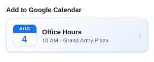 <!-- req-gallery:6.2.2 -->

</td>
<td valign="top">

`6.2.2` An end that isn't after the start is dropped — the single time is
shown.

</td>
</tr>
</table>

<table>
<tr>
<td valign="top" width="320">

 <!-- req-gallery:6.3 -->

</td>
<td valign="top">

`6.3` A date with no time reads **"All day"**.

</td>
</tr>
</table>

<table>
<tr>
<td valign="top" width="320">

 <!-- req-gallery:6.4 -->

</td>
<td valign="top">

`6.4` A start that can't be parsed to a date reads **"No date found"**.

</td>
</tr>
</table>

<table>
<tr>
<td valign="top" width="320">

 <!-- req-gallery:6.5 -->

</td>
<td valign="top">

`6.5` A card whose instance has no usable date shows **no** calendar chip — just
the title and the time line.

</td>
</tr>
</table>

<table>
<tr>
<td valign="top" width="320">

 <!-- req-gallery:6.6 -->

</td>
<td valign="top">

`6.6` A card always shows the page's **literal wall-clock** time and day: an
explicit UTC offset or trailing `Z` is stripped for display and **never re-zoned
to the viewer's timezone**. (The underlying instant still drives the Calendar
event — see productRequirements.)

</td>
</tr>
</table>

## 7. List, scrolling & overflow

<table>
<tr>
<td valign="top" width="320">

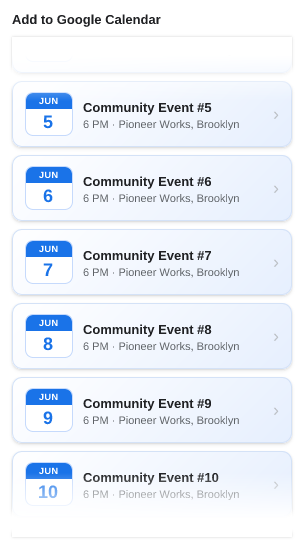 <!-- req-gallery:7.1 -->

</td>
<td valign="top">

`7.1` The event list is height-capped to roughly the first
`cardsVisibleBeforeScroll` rows plus a **peek** of the next card, and scrolls
past that.

</td>
</tr>
</table>

<table>
<tr>
<td valign="top" width="320">

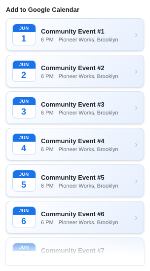 <!-- req-gallery:7.2 -->

</td>
<td valign="top">

`7.2` At most `maxCardsShown` cards render at first (the cap is on **cards** —
it's a height limit); "show all" (→ `8.5`) expands to `maxCardsExpanded`.

</td>
</tr>
</table>

<table>
<tr>
<td valign="top" width="320">

 <!-- req-gallery:7.3 -->

</td>
<td valign="top">

`7.3` A soft **white fade** appears at the **top** edge once scrolled away from
the top, and at the **bottom** edge while there's more list below — a cue that
there's more in that direction. An edge with nothing beyond it shows no fade.

</td>
</tr>
</table>

## 8. Count label

<table>
<tr>
<td valign="top" width="320">

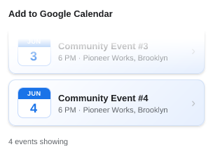 <!-- req-gallery:8.1 -->

</td>
<td valign="top">

`8.1` The count label is the **last item inside the scrollable list** (it
scrolls with the cards, so it's seen only once scrolled to the end).

</td>
</tr>
</table>

<table>
<tr>
<td valign="top" width="320">

 <!-- req-gallery:8.2 -->

</td>
<td valign="top">

`8.2` It counts **event instances**, not cards (a card can stand for several),
so its numbers can exceed the card count.

</td>
</tr>
</table>

<table>
<tr>
<td valign="top" width="320">

 <!-- req-gallery:8.3 -->

</td>
<td valign="top">

`8.3` When the whole list fits unscrolled, there is **no label**.

</td>
</tr>
</table>

<table>
<tr>
<td valign="top" width="320">

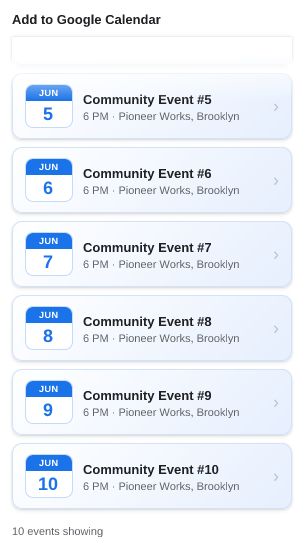 <!-- req-gallery:8.4 -->

</td>
<td valign="top">

`8.4` When every card is shown but the list is taller than fits: "**N events
showing**" — a scroll cue, with no "out of" and no link.

</td>
</tr>
</table>

<table>
<tr>
<td valign="top" width="320">

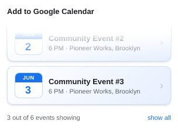 <!-- req-gallery:8.5 -->

</td>
<td valign="top">

`8.5` When only a prefix of the cards is shown and the list can still grow:
"**N out of M events showing**" with a right-aligned "**show all**" link that
expands the list to the `maxCardsExpanded` cap.

</td>
</tr>
</table>

<table>
<tr>
<td valign="top" width="320">

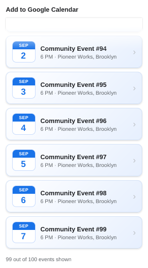 <!-- req-gallery:8.6 -->

</td>
<td valign="top">

`8.6` Once the `maxCardsExpanded` cap is reached with more still remaining:
"**N out of M events shown**" with **no** link.

</td>
</tr>
</table>

<table>
<tr>
<td valign="top" width="320">

 <!-- req-gallery:8.7 -->

</td>
<td valign="top">

`8.7` The "show all" link's presence keys off the **card** cap, not the event
count.

</td>
</tr>
</table>

## 9. Opening an event

<table>
<tr>
<td valign="top" width="320">

🚩 _Behavior leaf — verified by `test/unit/events-view-actions.test.js` (a click a snapshot can't show), not an image._ <!-- req-gallery:9.1 -->

</td>
<td valign="top">

`9.1` _(behavior)_ Clicking a single card opens that event's prefilled Google
Calendar template in a new browser tab.

</td>
</tr>
</table>

<table>
<tr>
<td valign="top" width="320">

🚩 _Behavior leaf — verified by `test/unit/events-view-actions.test.js` (a click a snapshot can't show), not an image._ <!-- req-gallery:9.2 -->

</td>
<td valign="top">

`9.2` _(behavior)_ Clicking a grouped card's instance button opens that
**specific showing's** template in a new tab.

</td>
</tr>
</table>

<table>
<tr>
<td valign="top" width="320">

🚩 _Behavior leaf — verified by `test/unit/events-view-actions.test.js` (a click a snapshot can't show), not an image._ <!-- req-gallery:9.3 -->

</td>
<td valign="top">

`9.3` _(behavior)_ A template opens in a tab **adjacent** to the current one,
and the popup then closes.

</td>
</tr>
</table>

## 10. Toolbar icon

The toolbar/extension icon signals how the current page's host is classified —
before the popup is even opened — so the user knows at a glance whether a one-click
extraction is first-class. It reflects the *host's classification*, not whether an
event was found (the icon can't read the page, so a page where the generic fallback
later finds an event still shows the blue icon). When the host is denylisted **or**
supported it would otherwise show two icons; supported wins. Unlike the rest of
this doc, these leaves are pinned by the **icon** snapshot test, not a popup
snapshot (see "Verification kind" above).

<table>
<tr>
<td valign="top" width="320">

 <!-- req-gallery:10.1 -->

</td>
<td valign="top">

`10.1` _(icon)_ On a host with a dedicated, first-class extractor (the **supported
list**), the icon is **green**.

</td>
</tr>
</table>

<table>
<tr>
<td valign="top" width="320">

 <!-- req-gallery:10.2 -->

</td>
<td valign="top">

`10.2` _(icon)_ On a host on the fallback **denylist** (where we've deliberately
decided not to extract), the icon is **gray**.

</td>
</tr>
</table>

<table>
<tr>
<td valign="top" width="320">

 <!-- req-gallery:10.3 -->

</td>
<td valign="top">

`10.3` _(icon)_ On any **other** page — neither supported nor denylisted, including
an allowlisted host — the icon stays the manifest default, **blue**.

</td>
</tr>
</table>

---

### A note on "clickable" and cursor / hover states

The snapshot renderer (satori → resvg) rasterizes the popup's **DOM**, not a live
browser, so it cannot show an OS **mouse cursor** or a `:hover`/`cursor: pointer`
state — those aren't DOM elements, and satori ignores interaction CSS. So
"clickable" (`4.4`) is not pinned by a cursor in the image. It's covered three
ways instead: the **behavior** (a click opens the event) by `9.1`; the resting
**visual cue** (the elevated surface + "›" chevron) by `5.4`; and, if we want an
explicit assertion that the surface *is* a button, a cheap **DOM check** (the
element is a `<button>` whose computed `cursor` is `pointer`) belongs in a unit
test — not a snapshot. (Tracked alongside the periodic edge-case review.)
