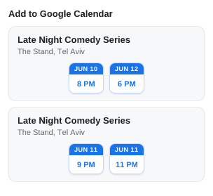
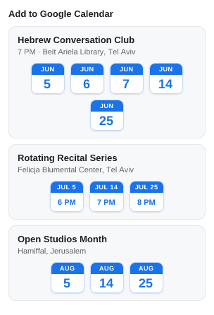
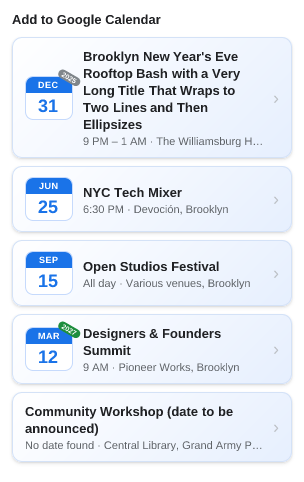
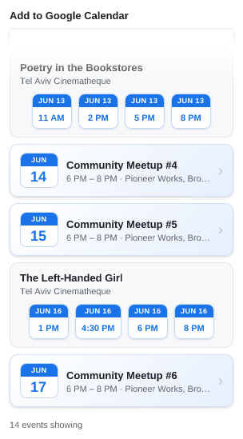
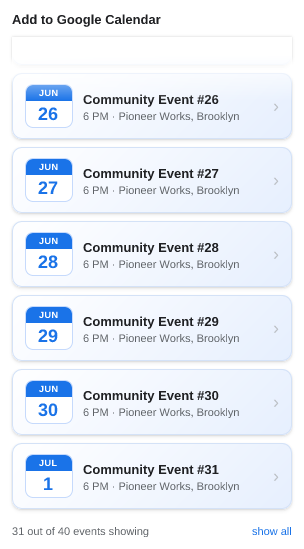
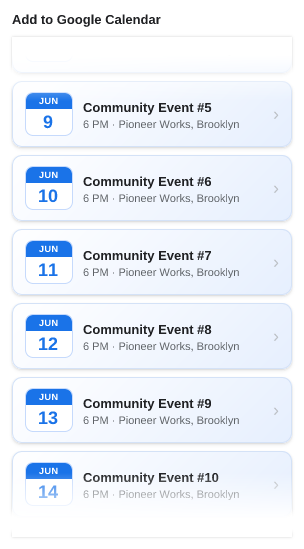

# UI snapshots

> **Generated file — do not edit by hand.** Run `npm run refresh:ui` to
> regenerate; `test/ui/readme.test.js` fails if it drifts.

Each popup state is a self-contained case in [`cases/`](cases/): a
`<name>.case.js` module supplying only *fake data* and the list of
[`uiRequirements.md`](../../docs/uiRequirements.md) IDs it checks, paired with
its reference `<name>.png`. The renderer feeds that data to `ui/popup.js`'s
real `render()` — the same `chooseContent` + views the extension runs — and
rasterizes the result, so these images track the shipped popup directly. See
[`docs/claude/testing.md`](../../docs/claude/testing.md) for the mechanics.

A case names its scenario and expectation and bundles several requirements into
one image. Every leaf requirement is covered by at least one case, enforced by
`test/uber/ui-requirements-coverage.test.js`; the coverage map below is the
generated proof.

## Requirement coverage

Every leaf requirement in [`docs/uiRequirements.md`](../../docs/uiRequirements.md), and the case(s) that check it.

| Requirement | Covered by |
| --- | --- |
| `1.1` | loading-heading-reads-reading-page |
| `1.2` | card-single-shows-pills-times-all-day-and-no-date link-unlisted-event-shows-suggest-correction |
| `1.3` | empty-denylisted-shows-glyph-without-link empty-nothing-found-shows-glyph-with-disagree-link |
| `2.1` | empty-denylisted-shows-glyph-without-link empty-nothing-found-shows-glyph-with-disagree-link |
| `2.2` | empty-nothing-found-shows-glyph-with-disagree-link |
| `2.3` | empty-denylisted-shows-glyph-without-link |
| `3.1` | link-unlisted-event-shows-suggest-correction |
| `3.2` | empty-nothing-found-shows-glyph-with-disagree-link |
| `3.3` | empty-nothing-found-shows-glyph-with-disagree-link link-unlisted-event-shows-suggest-correction |
| `3.4` | empty-nothing-found-shows-glyph-with-disagree-link link-unlisted-event-shows-suggest-correction |
| `4.1` | card-single-shows-pills-times-all-day-and-no-date |
| `4.2` | card-month-and-same-day-keep-a-button-per-instance card-month-header-shows-shared-time-or-location-only |
| `4.3` | card-month-header-shows-shared-time-or-location-only |
| `4.4` | card-single-shows-pills-times-all-day-and-no-date |
| `4.5` | card-month-and-same-day-keep-a-button-per-instance |
| `4.6` | card-month-and-same-day-keep-a-button-per-instance card-month-header-shows-shared-time-or-location-only |
| `4.7` | card-month-and-same-day-keep-a-button-per-instance |
| `4.8` | card-single-shows-pills-times-all-day-and-no-date |
| `4.9` | card-single-shows-pills-times-all-day-and-no-date |
| `4.10` | card-month-and-same-day-keep-a-button-per-instance |
| `5.1` | card-single-shows-pills-times-all-day-and-no-date |
| `5.2` | card-month-header-shows-shared-time-or-location-only card-single-shows-pills-times-all-day-and-no-date |
| `5.3` | card-month-and-same-day-keep-a-button-per-instance card-month-header-shows-shared-time-or-location-only |
| `5.4` | card-single-shows-pills-times-all-day-and-no-date |
| `5.5` | card-month-and-same-day-keep-a-button-per-instance |
| `5.6.1` | card-single-shows-pills-times-all-day-and-no-date |
| `5.6.2` | card-single-shows-pills-times-all-day-and-no-date |
| `5.6.3` | card-single-shows-pills-times-all-day-and-no-date |
| `5.7.1` | card-month-header-shows-shared-time-or-location-only |
| `5.7.2` | card-month-and-same-day-keep-a-button-per-instance card-month-header-shows-shared-time-or-location-only |
| `5.7.3` | card-month-header-shows-shared-time-or-location-only |
| `5.8` | card-single-shows-pills-times-all-day-and-no-date |
| `6.1` | card-single-shows-pills-times-all-day-and-no-date |
| `6.2` | card-single-shows-pills-times-all-day-and-no-date |
| `6.3` | card-single-shows-pills-times-all-day-and-no-date |
| `6.4` | card-single-shows-pills-times-all-day-and-no-date |
| `6.5` | card-single-shows-pills-times-all-day-and-no-date |
| `6.6` | card-single-shows-pills-times-all-day-and-no-date |
| `7.1` | list-scrolled-to-middle-fades-both-edges |
| `7.2` | list-capped-at-bottom-shows-n-out-of-m-with-show-all |
| `7.3` | list-all-cards-shown-counts-event-instances list-capped-at-bottom-shows-n-out-of-m-with-show-all list-scrolled-to-middle-fades-both-edges |
| `8.1` | list-all-cards-shown-counts-event-instances list-capped-at-bottom-shows-n-out-of-m-with-show-all |
| `8.2` | list-all-cards-shown-counts-event-instances |
| `8.3` | card-single-shows-pills-times-all-day-and-no-date |
| `8.4` | list-all-cards-shown-counts-event-instances |
| `8.5` | list-capped-at-bottom-shows-n-out-of-m-with-show-all |
| `8.6` | list-capped-at-bottom-shows-n-out-of-m-with-show-all |
| `8.7` | list-capped-at-bottom-shows-n-out-of-m-with-show-all |
| `9.1` | card-single-shows-pills-times-all-day-and-no-date |
| `9.2` | card-month-and-same-day-keep-a-button-per-instance |
| `9.3` | card-single-shows-pills-times-all-day-and-no-date |

## card-month-and-same-day-keep-a-button-per-instance

One event's June showings: single-show days 10 & 12 fold into a month card (a button per day), the two-show day 11 stays its own same-day card — the month card sorts first despite holding day 12, and every instance keeps its own time-chip button

Requirements: `4.2`, `4.5`, `4.6`, `4.7`, `4.10`, `5.3`, `5.5`, `5.7.2`, `9.2`

## card-month-header-shows-shared-time-or-location-only

Three month cards: scattered dates that share one start time show it in the header over day chips; differing-time dates drop to a location-only header with time chips; all-day dates show a location-only header with day chips

Requirements: `4.2`, `4.3`, `4.6`, `5.2`, `5.3`, `5.7.1`, `5.7.2`, `5.7.3`

## card-single-shows-pills-times-all-day-and-no-date

Single cards on a supported host: past→gray pill, this-year→no pill, future→green pill; round vs minute times, a start–end range, an all-day multi-day card, and a dateless card — all sorted chronologically with no count label

Requirements: `1.2`, `4.1`, `4.4`, `4.8`, `4.9`, `5.1`, `5.2`, `5.4`, `5.6.1`, `5.6.2`, `5.6.3`, `5.8`, `6.1`, `6.2`, `6.3`, `6.4`, `6.5`, `6.6`, `8.3`, `9.1`, `9.3`

## empty-denylisted-shows-glyph-without-link

Denylisted host (or a supported host that found nothing): the 'No events found' heading over the calendar glyph alone — no policy link

Requirements: `1.3`, `2.1`, `2.3`

## empty-nothing-found-shows-glyph-with-disagree-link

Nothing found (non-denylisted): the 'No events found' heading over the calendar glyph, with a quiet 'Disagree?' policy link beneath it

Requirements: `1.3`, `2.1`, `2.2`, `3.2`, `3.3`, `3.4`

## link-unlisted-event-shows-suggest-correction

Unlisted host with a complete fallback event: the event card plus a right-aligned, understated 'Suggest Correction' link on the heading line

Requirements: `1.2`, `3.1`, `3.3`, `3.4`

## list-all-cards-shown-counts-event-instances

Eight cards (two of them same-day films of four screenings each) overflow the cap; scrolled to the bottom the end reads '14 events showing' — counting instances, not cards — with only the top edge faded

Requirements: `7.3`, `8.1`, `8.2`, `8.4`

## list-capped-at-bottom-shows-n-out-of-m-with-show-all

Forty cards exceed the first-render cap; scrolled to the bottom the end reads 'N out of M events showing' with a 'show all' link, over a faded top edge

Requirements: `7.2`, `7.3`, `8.1`, `8.5`, `8.6`, `8.7`

## list-scrolled-to-middle-fades-both-edges

A long list scrolled to its middle: the height cap clips both ends, so both edge fades show over a peek of the cut cards

Requirements: `7.1`, `7.3`

## loading-heading-reads-reading-page

Initial load, before extraction returns: the heading reads 'Reading page…' over an empty body

Requirements: `1.1`

