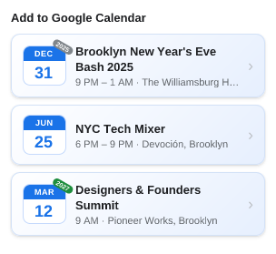
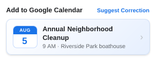
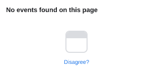
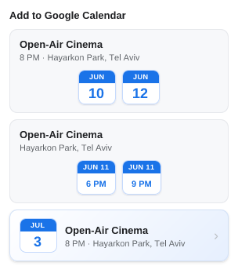
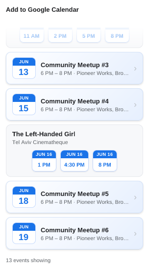

# UI snapshots

> **Generated file — do not edit by hand.** Run `npm run refresh:ui` to
> regenerate; `test/ui/readme.test.js` fails if it drifts.

Each popup state is a self-contained case in [`cases/`](cases/): a
`<name>.case.js` module supplying only *fake data*, paired with its reference
`<name>.png`. The renderer feeds that data to `ui/popup.js`'s real
`render()` — the same `chooseContent` + views the extension runs — and
rasterizes the result, so these images track the shipped popup directly. See
[`docs/claude/testing.md`](../../docs/claude/testing.md) for the mechanics.

The gallery below shows every case's reference image with its description, so the
current (or changed) state is reviewable straight from GitHub.

## 01-off-year-single-cards-get-a-year-pill-past-gray-future-green

Off-year single cards get a year pill: a past year (2025) a gray pill, the current year (2026) none, a future year (2027) a green pill

## 02-unlisted-host-shows-event-plus-suggest-correction-link

Unlisted host with a complete event: show it plus a right-aligned 'Suggest Correction' link

## 03-no-events-found-shows-glyph-and-disagree-link

No events found: the empty calendar glyph and a 'Disagree?' policy link

## 04-denylisted-host-suppresses-even-a-complete-event

Denylisted host suppresses even a complete event: the empty glyph with no link or prompt

## 05-same-day-screenings-each-become-their-own-time-button

Same-day screenings each become their own time button: one same-day card, a chip per showing (single times and a time range)

## 06-month-card-header-shows-shared-time-else-per-day-times-or-allday

Month card surfaces a shared start time in its header (day chips that wrap when many, consecutive days not merged), else per-day time chips, else just the location (all-day dates)

## 07-one-event-splits-into-month-same-day-and-single-cards

One event splits into several cards: a month card (its single-show June days), a same-day card (the two-show day), and a single card (the lone July day)

## 08-capped-list-scrolled-to-end-shows-count-and-show-all-link

Capped list scrolled to the end: the 'N out of M events showing' count, a 'show all' link, and the top edge fade

## 09-count-label-counts-event-instances-not-cards

The count cue counts event instances, not cards: a mixed list of 8 cards (two of them same-day cards) holds 13 events, so the end reads '13 events showing'

## 10-overflowing-list-at-rest-fades-out-its-bottom-edge

Overflowing list at rest at the top: the bottom edge fades out to cue there's more below

