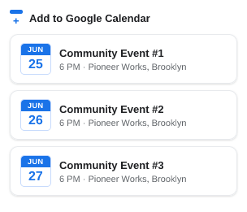
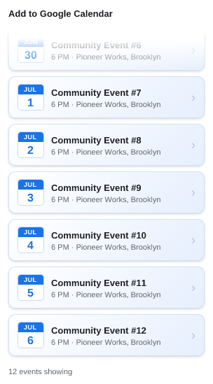
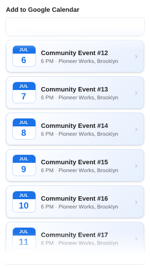
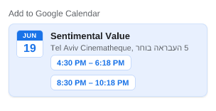
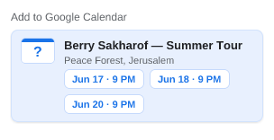
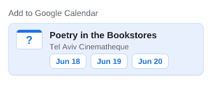
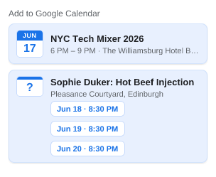
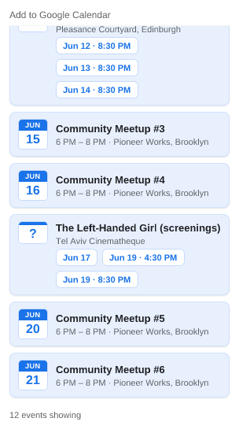

# UI snapshots

> **Generated file — do not edit by hand.** Run `npm run refresh:ui` to
> regenerate; `test/ui/readme.test.js` fails if it drifts.

Each popup state is a self-contained case in [`cases/`](cases/): a
`<name>.case.js` module supplying only *fake data*, paired with its reference
`<name>.png`. The renderer feeds that data to `ui/popup.js`'s real
`render()` — the same `chooseContent` + views the extension runs — and
rasterizes the result, so these images track the shipped popup directly. See
[`docs/claude/testing.md`](../../docs/claude/testing.md) for the mechanics.

The gallery below shows every case's reference image with its description, so the
current (or changed) state is reviewable straight from GitHub.

## 01-supported-listing

Supported host: the extractor's events (a 2-event listing)

## 02-denylisted

Denylisted host: 'No events found' (no link, no prompt) — even a complete event is suppressed

## 03-nothing-found

Nothing found: 'No events found' + a right-aligned 'Disagree?' link

## 04-allowlisted

Allowlisted: show the event (no support request)

## 05-unlisted

Unlisted: show the event + a right-aligned 'Suggest Correction' link

## 06-fits-no-fade

Short listing that fits: no scroll, no edge fades

## 07-overflow-bottom-fade

Overflowing list, top of scroll: bottom edge fades out (more below)

## 08-scrolled-top-fade

Scrolled to the bottom: top edge fades out, no bottom fade

## 09-scrolled-middle-both-fades

Scrolled to the middle of a long list: both edges fade out

## 10-scrolled-bottom-count

Long capped list scrolled to the bottom: 'N out of M' + top fade only

## 11-multi-instance-same-day-times

Multi-instance, one date: icon shows the date, instance buttons show the times (with ranges)

## 12-multi-instance-different-dates-timed

Multi-instance, different dates (timed): icon is a '?', instance buttons show date · time

## 13-multi-instance-different-dates-allday

Multi-instance, different dates (all-day): icon is a '?', instance buttons show the dates

## 14-multi-instance-mixed

Multi-instance, mixed: several dates incl. an all-day one and a date with two times; icon is a '?'

## 15-mixed-single-and-multi-listing

A listing mixing a single-occurrence card and a multi-instance card

## 16-events-outnumber-cards-count

Count cue counts events, not cards: 8 cards (two multi-instance) -> more events than cards

