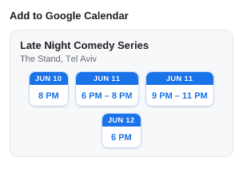

# UI snapshots

> **Generated file — do not edit by hand.** Run `npm run refresh:ui` to
> regenerate; `test/ui/readme.test.js` fails if it drifts.

Each popup state is a self-contained case in [`cases/`](cases/): a
`<name>.case.js` module supplying only *fake data* and the
[`uiRequirements.md`](../../docs/uiRequirements.md) IDs it checks, paired with
its reference `<name>.png`. The renderer feeds that data to `ui/popup.js`'s
real `render()` — the same `chooseContent` + views the extension runs — and
rasterizes the result, so these images track the shipped popup directly. See
[`docs/claude/testing.md`](../../docs/claude/testing.md) for the mechanics.

A case names its scenario and expectation and bundles several requirements into
one image. Under each case, **Checks** lists the requirements it pins — each ID
links into [`uiRequirements.md`](../../docs/uiRequirements.md) and carries a
brief note on what that case checks for it. Every leaf requirement is covered by
at least one case, enforced by `test/uber/ui-requirements-coverage.test.js`.

## card-month-header-shows-shared-time-or-location-only

Three month cards: scattered dates that share one start time show it in the header over day chips; differing-time dates drop to a location-only header with time chips; all-day dates show a location-only header with day chips

Checks:

- [`4.2`](../../docs/uiRequirements.md#4-event-cards--grouping--ordering) — each event's scattered days fold into one month card
- [`4.3`](../../docs/uiRequirements.md#4-event-cards--grouping--ordering) — the consecutive run Jun 5–7 stays one button per day, not merged
- [`4.6`](../../docs/uiRequirements.md#4-event-cards--grouping--ordering) — each is an unclickable month card: a header over per-showing buttons
- [`5.2`](../../docs/uiRequirements.md#5-event-cards--appearance) — the bare buttons are day chips (month banner over day-of-month)
- [`5.3.1`](../../docs/uiRequirements.md#5-event-cards--appearance) — a single-time June showing shows just its time
- [`5.7.1`](../../docs/uiRequirements.md#5-event-cards--appearance) — June's shared 7 PM leads the header and buttons stay bare day chips
- [`5.7.2`](../../docs/uiRequirements.md#5-event-cards--appearance) — July's differing times drop to a location-only header with time chips
- [`5.7.3`](../../docs/uiRequirements.md#5-event-cards--appearance) — August's all-day days give a location-only header with day chips

## card-month-keeps-same-day-showings-as-buttons

One event's June showings in a single card: the day with two showings (Jun 11) keeps a button per showing next to the single-showing days (Jun 10, Jun 12) — never peeled into a separate card — with differing times making each button a date+time chip

Checks:

- [`4.2`](../../docs/uiRequirements.md#4-event-cards--grouping--ordering) — the four June showings group by month into one card
- [`4.5`](../../docs/uiRequirements.md#4-event-cards--grouping--ordering) — Jun 11's two showings stay as two buttons, not peeled into a separate card
- [`4.6`](../../docs/uiRequirements.md#4-event-cards--grouping--ordering) — the month card is a header over one button per showing
- [`4.7`](../../docs/uiRequirements.md#4-event-cards--grouping--ordering) — the grouped card has no single left calendar icon
- [`5.3.1`](../../docs/uiRequirements.md#5-event-cards--appearance) — Jun 10 and Jun 12 are single-time buttons showing just the time
- [`5.3.2`](../../docs/uiRequirements.md#5-event-cards--appearance) — Jun 11's two showings carry start+end, so their buttons show a time range
- [`5.5`](../../docs/uiRequirements.md#5-event-cards--appearance) — the grouped card is flat, not itself clickable, with no chevron
- [`5.7.2`](../../docs/uiRequirements.md#5-event-cards--appearance) — the showings' differing times make each button a date+time chip

## card-single-shows-pills-times-all-day-and-no-date

Single cards on a supported host: past→gray pill, this-year→no pill, future→green pill; round vs minute times, a start–end range, an all-day multi-day card, and a dateless card — all sorted chronologically with no count label

Checks:

- [`1.2`](../../docs/uiRequirements.md#1-heading) — events present, so the heading reads "Add to Google Calendar"
- [`4.1`](../../docs/uiRequirements.md#4-event-cards--grouping--ordering) — one card per event on the page
- [`4.4`](../../docs/uiRequirements.md#4-event-cards--grouping--ordering) — the single-showing and dateless cards are each a whole-card click target
- [`4.8`](../../docs/uiRequirements.md#4-event-cards--grouping--ordering) — E4 spans Sep 15–18 yet stays one single card, not split per day
- [`4.9`](../../docs/uiRequirements.md#4-event-cards--grouping--ordering) — the shuffled events render sorted chronologically
- [`5.1`](../../docs/uiRequirements.md#5-event-cards--appearance) — each card carries the calendar-chip "addable event" motif
- [`5.2`](../../docs/uiRequirements.md#5-event-cards--appearance) — the left indicator is a day chip (month banner over day-of-month)
- [`5.4`](../../docs/uiRequirements.md#5-event-cards--appearance) — a single card is elevated/tinted with a trailing "›" chevron
- [`5.6.1`](../../docs/uiRequirements.md#5-event-cards--appearance) — E1 (2025) is past → gray year pill
- [`5.6.2`](../../docs/uiRequirements.md#5-event-cards--appearance) — E3 (2027) is future → green year pill
- [`5.6.3`](../../docs/uiRequirements.md#5-event-cards--appearance) — E2 (this year) shows no pill
- [`5.8`](../../docs/uiRequirements.md#5-event-cards--appearance) — E1's long title clamps to two lines and its location ellipsizes
- [`6.1.1`](../../docs/uiRequirements.md#6-date--time-display) — E3's round 9:00 hour drops its minutes ("9 AM")
- [`6.1.2`](../../docs/uiRequirements.md#6-date--time-display) — E1's non-round 6:30 keeps its minutes
- [`6.2.1`](../../docs/uiRequirements.md#6-date--time-display) — E1's start+end renders as an en-dash time range
- [`6.2.2`](../../docs/uiRequirements.md#6-date--time-display) — E6's end equals its start, so it's dropped to a single time
- [`6.3`](../../docs/uiRequirements.md#6-date--time-display) — E4 is date-only, so it reads "All day"
- [`6.4`](../../docs/uiRequirements.md#6-date--time-display) — E5 has no parseable start, so it reads "No date found"
- [`6.5`](../../docs/uiRequirements.md#6-date--time-display) — E5 shows no calendar chip (no usable date)
- [`6.6`](../../docs/uiRequirements.md#6-date--time-display) — E1's -05:00 offset is shown as literal wall-clock, not re-zoned
- [`8.3`](../../docs/uiRequirements.md#8-count-label) — the list fits unscrolled, so there is no count label

## empty-denylisted-shows-glyph-without-link

Denylisted host (or a supported host that found nothing): the 'No events found' heading over the calendar glyph alone — no policy link

Checks:

- [`1.3`](../../docs/uiRequirements.md#1-heading) — nothing shown, so the heading reads "No events found on this page"
- [`2.1`](../../docs/uiRequirements.md#2-empty-state-nothing-to-add) — the event area shows the single muted calendar glyph
- [`2.3`](../../docs/uiRequirements.md#2-empty-state-nothing-to-add) — the glyph stands alone — no link beneath it

## empty-nothing-found-shows-glyph-with-disagree-link

Nothing found (non-denylisted): the 'No events found' heading over the calendar glyph, with a quiet 'Disagree?' policy link beneath it

Checks:

- [`1.3`](../../docs/uiRequirements.md#1-heading) — nothing shown, so the heading reads "No events found on this page"
- [`2.1`](../../docs/uiRequirements.md#2-empty-state-nothing-to-add) — the event area shows the single muted calendar glyph
- [`2.2`](../../docs/uiRequirements.md#2-empty-state-nothing-to-add) — the "Disagree?" link sits beneath the glyph
- [`3.2`](../../docs/uiRequirements.md#3-affordance-links) — the "Disagree?" link is shown (state 3 opens the policy doc)
- [`3.3`](../../docs/uiRequirements.md#3-affordance-links) — the link uses the small, understated accent-blue treatment

## link-unlisted-event-shows-suggest-correction

Unlisted host with a complete fallback event: the event card plus a right-aligned, understated 'Suggest Correction' link on the heading line

Checks:

- [`1.2`](../../docs/uiRequirements.md#1-heading) — an event is shown, so the heading reads "Add to Google Calendar"
- [`3.1`](../../docs/uiRequirements.md#3-affordance-links) — "Suggest Correction" sits on the heading line, right-aligned
- [`3.3`](../../docs/uiRequirements.md#3-affordance-links) — the link uses the small, understated accent-blue treatment

## list-all-cards-shown-counts-event-instances

Eight cards (two of them same-day films of four screenings each) overflow the cap; scrolled to the bottom the end reads '14 events showing' — counting instances, not cards — with only the top edge faded

Checks:

- [`7.3`](../../docs/uiRequirements.md#7-list-scrolling--overflow) — scrolled to the bottom, only the top edge fades
- [`8.1`](../../docs/uiRequirements.md#8-count-label) — the count label is the list's last item, in view at the bottom
- [`8.2`](../../docs/uiRequirements.md#8-count-label) — it counts instances, not cards: 8 cards but "14 events showing"
- [`8.4`](../../docs/uiRequirements.md#8-count-label) — every card is shown but the list overflows, so it reads "N events showing" with no link

## list-capped-at-bottom-shows-n-out-of-m-with-show-all

Forty cards exceed the first-render cap; scrolled to the bottom the end reads 'N out of M events showing' with a 'show all' link, over a faded top edge

Checks:

- [`7.2`](../../docs/uiRequirements.md#7-list-scrolling--overflow) — only a prefix of the 40 cards renders at first (the card cap)
- [`7.3`](../../docs/uiRequirements.md#7-list-scrolling--overflow) — scrolled to the bottom, the top edge fades
- [`8.1`](../../docs/uiRequirements.md#8-count-label) — the count label is the list's last item, in view at the bottom
- [`8.5`](../../docs/uiRequirements.md#8-count-label) — the prefix reads "N out of M events showing" with a "show all" link
- [`8.6`](../../docs/uiRequirements.md#8-count-label) — past the expanded cap it would read "shown" with no link (behavior)
- [`8.7`](../../docs/uiRequirements.md#8-count-label) — the "show all" link keys off the card cap, not the event count

## list-scrolled-to-middle-fades-both-edges

A long list scrolled to its middle: the height cap clips both ends, so both edge fades show over a peek of the cut cards

Checks:

- [`7.1`](../../docs/uiRequirements.md#7-list-scrolling--overflow) — the height cap clips both ends, showing a peek of the cut cards
- [`7.3`](../../docs/uiRequirements.md#7-list-scrolling--overflow) — with list above and below, both edge fades show

## loading-heading-reads-reading-page

Initial load, before extraction returns: the heading reads 'Reading page…' over an empty body

Checks:

- [`1.1`](../../docs/uiRequirements.md#1-heading) — the initial shell, before extraction returns, reads "Reading page…"

## req-5.6.1

5.6.1 — a single card dated in a past year shows a gray year pill on its calendar chip

