# UI snapshots

> **Generated file — do not edit by hand.** Run `npm run refresh:ui` to
> regenerate; `test/ui/readme.test.js` fails if it drifts.

Each popup state is a self-contained case in [`cases/`](cases/): a
`<name>.case.js` module supplying only *fake data*, paired with its reference
`<name>.png`. The renderer feeds that data to `ui/popup.js`'s real
`render()` — the same `chooseContent` + views the extension runs — and
rasterizes the result, so these images track the shipped popup directly. See
[`docs/claude/testing.md`](../../docs/claude/testing.md) for the mechanics.

The gallery below shows every case's reference image with its description, so the
current (or changed) state is reviewable straight from GitHub.

## 01-supported-listing

Supported host: events across past, current, and future years (off-year cards get a year pill); the current-year event's times carry a UTC offset shown as wall-clock

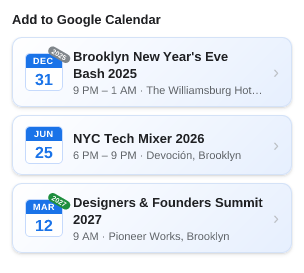

## 02-denylisted

Denylisted host: 'No events found' (no link, no prompt) — even a complete event is suppressed

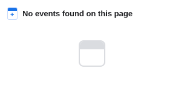

## 03-nothing-found

Nothing found: 'No events found' + a right-aligned 'Disagree?' link

## 04-allowlisted

Allowlisted: show the event (no support request)

## 05-unlisted

Unlisted: show the event + a right-aligned 'Suggest Correction' link

## 06-overflow-bottom-fade

Overflowing list, top of scroll: bottom edge fades out (more below)

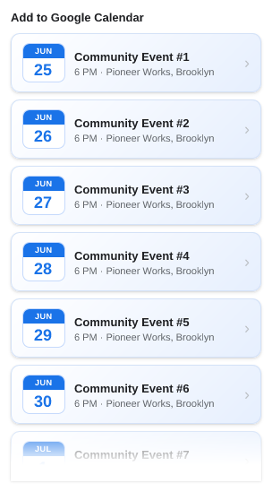

## 07-scrolled-middle-both-fades

Scrolled to the middle of a long list: both edges fade out

## 08-scrolled-bottom-count

Long capped list scrolled to the bottom: 'N out of M' + top fade only

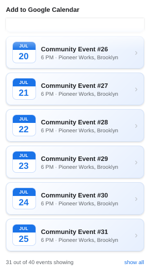

## 09-month-scattered-with-sameday

Month grouping: two scattered single-show days fold into one month card; a two-show day stays a same-day card

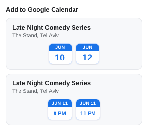

## 10-same-day-three-screenings

Same day, three screenings: one same-day card with a button per time

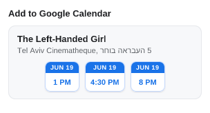

## 11-month-allday-and-sameday

Month grouping with an all-day day and a timed day folding into one month card, plus a same-day card

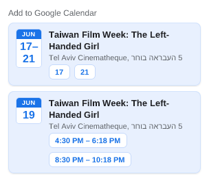

## 12-events-outnumber-cards-count

Count cue counts events, not cards: 8 cards (two same-day cards) -> 13 events showing

## 13-month-grouped-across-months

Month grouping across months: three scattered June dates become one JUN card (5/14/25), the July date a single card

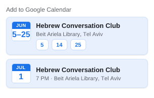

## 14-consecutive-run-instances

Consecutive days aren't merged: Jun 5–7 + scattered Jun 14/25 are one month card with a button per day; July is a single card

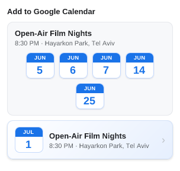

## 15-month-common-time-header

Month card common-time header: scattered dates that share one start time show it above the icons; differing-time and all-day month cards show only the location

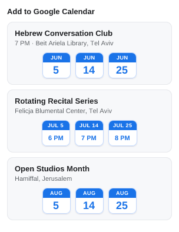

## 16-mixed-grouping-overflow-top

Many instances of mixed grouping styles (single, same-day, month, all-day) overflowing at the top of scroll: bottom fade only

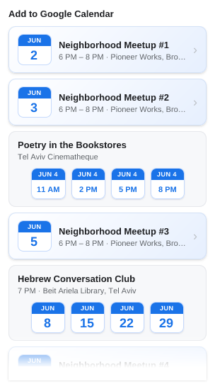

## 17-mixed-grouping-scrolled-bottom

Many mixed-grouping instances scrolled to the bottom: count cue sums instances across single, same-day, and month cards; top fade only

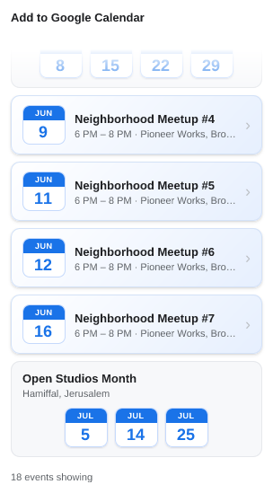

## 18-many-instances-one-card

Many instances in ONE card: a single event's dozen scattered dates fold into one month card with a button per day

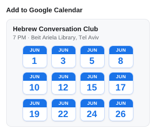
