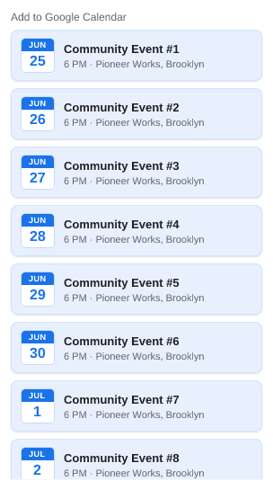
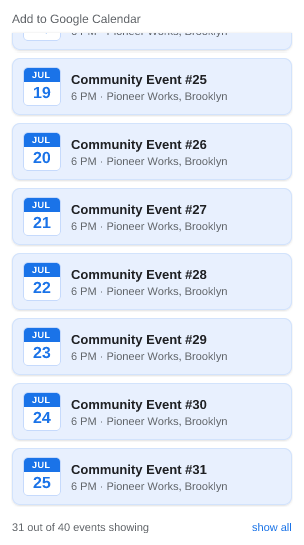
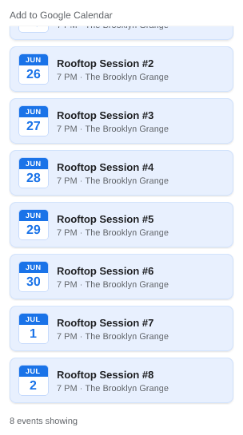

# UI snapshots

> **Generated file — do not edit by hand.** Run `npm run refresh:ui` to
> regenerate; `test/ui/readme.test.js` fails if it drifts.

Each popup state is a self-contained case in [`cases/`](cases/): a
`<name>.case.js` module supplying only *fake data*, paired with its reference
`<name>.png`. The renderer feeds that data to `ui/popup.js`'s real
`render()` — the same `chooseContent` + views the extension runs — and
rasterizes the result, so these images track the shipped popup directly. See
[`docs/claude/testing.md`](../../docs/claude/testing.md) for the mechanics.

The gallery below shows every case's reference image with its description, so the
current (or changed) state is reviewable straight from GitHub.

## 01-supported-listing

Supported host: the extractor's events (a 2-event listing)

## 02-denylisted

Denylisted host: 'No events found' (no link, no prompt) — even a complete event is suppressed

## 03-nothing-found

Nothing found: 'No events found' + a right-aligned 'Disagree?' link

## 04-allowlisted

Allowlisted: show the event (no support request)

## 05-unlisted

Unlisted: show the event + a right-aligned 'Suggest Correction' link

## 06-long-listing-top

Long listing, top of scroll: capped list, count label below the fold

## 07-long-listing-scrolled

Long listing, scrolled to bottom: 'N out of M events showing' + 'show all' link

## 08-all-shown-scrolled

Eight events, scrolled to bottom: the plain 'N events showing' cue (no link)

